# Project - Weather app
This project is a weather application that collects data from a sensor (BMP280) using
Raspberry Pi Pico W circuitry. The Pico W uses wireless connectivity to send
the data into the cloud and then is forwarded to the database. The two data
points are then retrieved from the database and visualized in the mobile appli-
cation. Additionally, the temperature reading is used as a control for an LED.
A temperature that is too low will turn on the LED

# Getting Started
Necessary components
- Raspberry Pi Pico W
- BMP280 sensor

## Step 1 (Thonny):
1. Download thonny.
https://micropython.org/download/RPI_PICO_W/

2. Download necessary packages into thonny. "Tools" > "Manage packages" > "umqtt.robust" and "umqtt.simple"

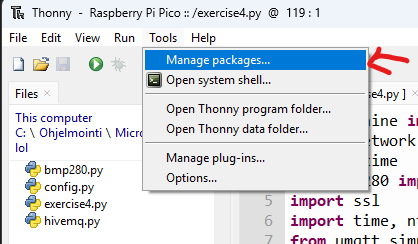

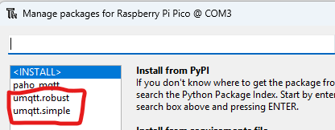

3. Change the parameters of MQTT CONFIG and the Wifi connection.

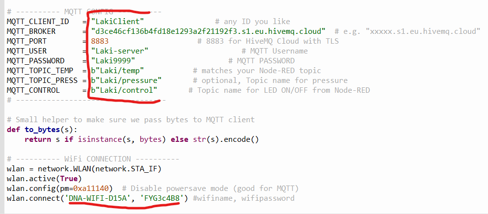 

NOTE! MQTT_BROKER, PORT, USER and PASSWORD will get from HIVEMQ.

## Step 2 (HiveMQ):
1. Login to HiveMQ or create an account.

2. Create a new cluster and select free.
Manage cluster and copy the URL and the port into your main.py

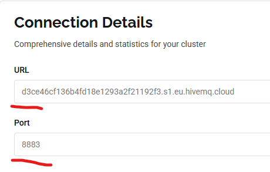

3. Go to access management in your service and add credentials. These credentials are added to the code.

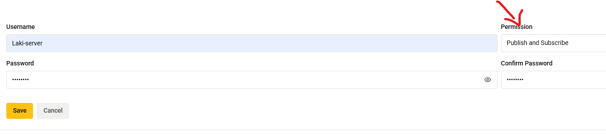

4. Then go to web client and start the cloud with your credentials.

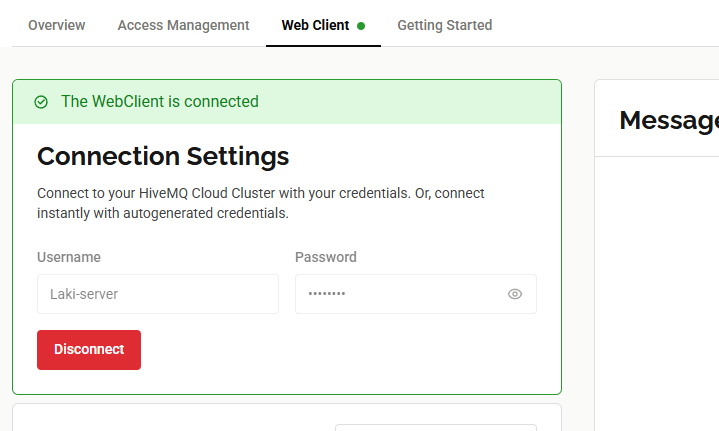

You can try to connect to the wifi and MQTT broker. Subscribe on web client and you can see the data.

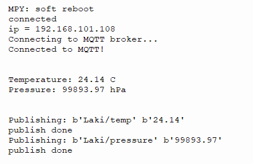

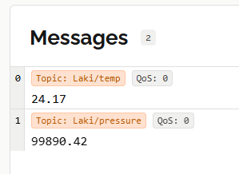

## Step 3 (InfluxDB):
1. Install InfluxDB. https://docs.influxdata.com/influxdb/v2/install/?t=Windows+Powershell

2. Unextract the files. Open CMD and move to the directory, where the files are located.
Then run command `.\influxd.exe`

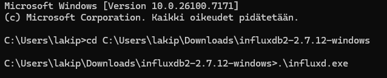

3. Login or create an account to InfluxDB Cloud 2.0.

4. Create a bucket and all access API token. Save the API token, we will need it later.

Successfully published data can be seen in the "data explorer" 

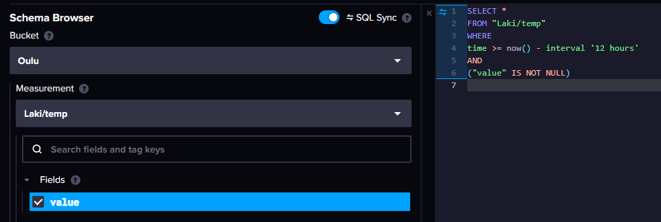

## Step 4 (Nodejs):
1. Install nodejs. https://nodejs.org/en

2. Open CMD as administrator and run the following commands.

`npm install -g --unsafe-perm node-red`

`node-red` < start node

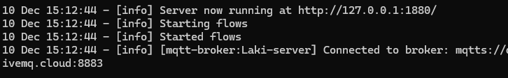

Go to http://localhost:1880.

3. Install required packages: 
Go to the menu (top right corner) > "Manage palette" > "Install" > "node-red-contrib-influxdb"

4. Import the "flowsModule.json" from the menu.  

### Modify following nodes: 
1. MQTT in (Data-temp) <-- HiveMQ credentials. Influxdb out (Data-temp) <-- InfluxDB credentials

2. MQTT in (Data-pressure) <-- HiveMQ credentials. Influxdb out (Data-pressure) <-- InfluxDB credentials

3. InfluxDB in (Data in) <-- InfluxDB credentials

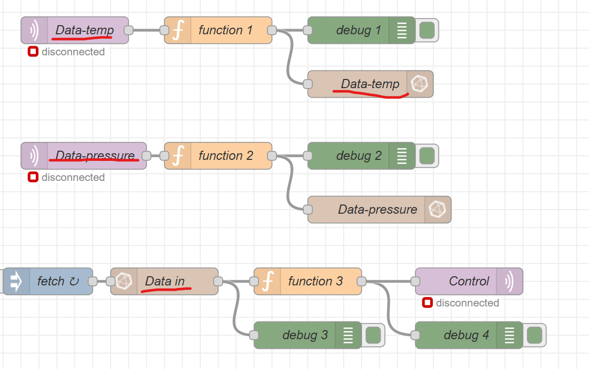

## Step 5 (Mobile App)

The Android mobile application displays real-time sensor readings (temperature and pressure)
and visualizes historical data retrieved directly from InfluxDB Cloud. The app communicates
with InfluxDB using HTTPS Flux queries through Retrofit/OkHttp, with no backend server in between.

### 📱 5.1 Install the Mobile App

You can install the app in two ways:

#### **Option A — Download APK (recommended)**
1. Go to the GitHub Releases page:
   👉 https://github.com/JuhoHummasti/iot_projekti/releases/latest
2. Download **app-release.apk**
3. Copy the file to your Android phone
4. Open the APK and allow installation from “Unknown sources”
5. Launch **PicoW Sensor Monitor**

_No Android Studio needed._

---

#### **Option B — Build the App Manually (Developers)**

1. Open the project folder in Android Studio:
2. Build and run the app:
### 🔑 5.2 Configure InfluxDB Credentials

The app requires an API token and connection details for InfluxDB Cloud.

Create (or edit) the `local.properties` file in the Android project root:

INFLUX_TOKEN=your_influx_token_here
INFLUX_ORG=your_org_id
INFLUX_BUCKET=Oulu
INFLUX_BASE_URL=https://us-east-1-1.aws.cloud2.influxdata.com/

> ⚠️ This file is ignored by Git and must be created locally.

---

### 📊 5.3 Features of the Mobile App

#### **Home Screen**
- Displays the latest temperature and pressure values  
- Shows timestamp and device ID  
- Automatically refreshes periodically  

#### **History Screen**
- Supports 24h, Week, Month, and Year time ranges  
- Navigate to previous / next periods  
- Dual-axis chart:
  - Left axis → Temperature
  - Right axis → Pressure
  - Bottom axis → Time  
- Smooth Canvas-based graph rendering  

#### **Backend Communication**
- App talks **directly** to InfluxDB Cloud
- Uses:
  - Retrofit for HTTP queries  
  - OkHttp for networking  
  - Flux queries for retrieving time-series data  

---

### 📦 5.4 Libraries Used

- Jetpack Compose (UI)
- Material 3
- Retrofit + Scalars Converter
- OkHttp + Logging Interceptor
- Kotlin Coroutines
- AndroidX Lifecycle + ViewModel

---
